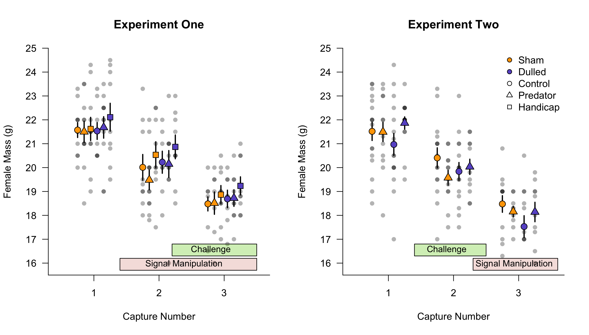

```{r setup-main, include=FALSE, echo = FALSE}
  knitr::opts_chunk$set(echo = TRUE)
  pacman::p_load(ggplot, tidyverse, here, kableExtra, ggpubr)
  #source(knitr::purl(here::here("3_r_scripts", "Full_analysis_supplement.Rmd"), quiet=TRUE)) #runs full analysis script
```

CCT, SMM, JJU, TAR, DCVO, MNV: Department of Ecology & Evolutionary Biology and Lab of Ornithology, Cornell University  

ASI: Odom School of Ecology, University of Georgia  

CZ: Laboratoire d'Ethologie Expérimentale et Comparée, University Sorbonne Paris Nord  


*Correspondance: Conor C. Taff; cct63@cornell.edu*

\newpage

# ABSTRACT

Animals in wild populations often face multiple challenges that occur in sequence or simultaneously and an appropriate response to one challenge might either hinder or enhance the response to subsequent challenges. The social environment that individuals experience appears to be a particularly salient mediator of stress resilience, as the nature and valence of social interactions are often related to subsequent health, physiology, microbiota, and overall stress resilience. Relatively few studies have simultaneously manipulated the social environment and ecological challenges under natural conditions. Here, we report the results of experiments in wild tree swallows (*Tachycineta bicolor*) in which we manipulated both ecological challenges (predator encounters and flight efficiency reduction) and social interactions (by experimental dulling of a social signal). In two experiments conducted in separate years, we reversed the order of these treatments so that females experienced either an altered social environment followed by a challenge or vice-versa. Before, during, and after treatments were applied, we tracked breeding success, adult and nestling morphology and physiology (corticosterone and glucose), social interactions via an RFID sensor network, and female microbiome diversity. Overall, we found that predator exposure reduced the number of offspring fledged and that signal manipulation altered social interactions, but little evidence that the order of exposure mattered or that the two categories of treatment interacted with each other. We discuss the implications of our results for understanding what types of challenges and what conditions are most likely to result in interactions between social and ecological challenges.

*Keywords: multiple stressors, social feedback, social signaling*

# INTRODUCTION

Exposure to stressors can profoundly influence how individuals cope with future challenges. However, it is often unclear why stressful situations sometimes prime individuals to respond more effectively to future challenges, while at other times they trigger debilitating responses. Social position and social connectedness have emerged as key predictors of the psychophysiological impact of stress [@charuvastra2008; @holt2010; @yang2016]. At the same time, research on model organisms has begun to illuminate the potential for brief stressors to have long-lasting effects on epigenetic code [@sawamura2016; @weaver2004], neuroendocrine function [@lupien2009], and the communities of internal microbes that are increasingly recognized as important components of organismal health [@bailey2011; @rea2016].  

Social relationships appear to have an extraordinary impact on human health [@yang2016]. Socially connected individuals face nearly a two-fold increase in survival probability across causes [@holt2010]. Social connectedness has also emerged as a key predictor of long-term impairment from an acutely stressful event [@charuvastra2008]. These findings suggest that social interactions may change the biology of individuals that engage in them, in ways that alter their resistance to future or even past stressors. But progress in determining how, when, and why these changes occur has been hampered by methodological limitations. In the laboratory setting in which most animal models are studied, it is exceedingly difficult to replicate or realistically manipulate the complex and often extensive social networks characteristic of humans and other social species. Likewise, while simplified environments facilitate the rapid identification of candidate mechanisms, they do not enable the determination of how specific changes or combinations of changes affect health, performance, and survival under real-world conditions.  

In free-living vertebrates, decades of research have now described the typical physiological and behavioral responses to acute challenges [@sapolsky2000; @wingfield1998], but wild animals often encounter multiple stressors of different types in sequence or simultaneously. While the importance of multiple—potentially interacting—stressors has long been appreciated [@romero2009], there is growing interest in understanding how and when multiple challenges combine to create responses and outcomes that are not simply a result of adding each challenge together [@galic2018; @orr2020]. Conceptual models of the stress response suggest several ways that multiple challenges can create non-intuitive outcomes. For example, experiencing certain challenges might prime individuals to respond more effectively to a subsequent challenge of a different type [CITE] or an effective response to one challenge might reduce the ability to respond to a second challenge that requires a different physiological or behavioral response [CITE]. Thus, the order of encounter and timing of challenges may be very important in these situations and experiencing the same two challenges in different orders may produce different results [@taff2016].  

Here, we simulated ecological challenges either before or after manipulating the experienced social environment in free-living tree swallows (*Tachycineta bicolor*). Challenges included either a series of simulated predation attempts or a wing surface reduction that produced an energetic challenge. Previous work on tree swallows has demonstrated that similar manipulations can result in mass loss, delayed breeding, and nest failure [@taff2019; @winkler1995]. Individual variation in resilience to these challenges is predicted by genome-wide DNA methylation [@taff2019me] and a glucocorticoid stress-response that includes a robust upregulation of corticosterone after capture coupled with strong negative feedback [@vitousek2018fee; @zimmer2019].  

Social environment was manipulated by dulling the white breast plumage that functions as a social signal. Naturally brighter white plumage in females is associated with the number and pattern of social interactions at the nest box as measured by a radio frequency identification sensor network and—under challenging conditions—naturally bright plumage is associated with higher reproductive success [@taff2019]. In other tree swallow populations, the brightness of white plumage is associated with immunity, nestling quality, nest retention, and the frequency or intensity of aggressive interactions at the nest box [@beck2015; @berzins2016; @berzins2018; @coady2013]. A previous experiment that manipulated color—but not ecological challenges—in this population found that experimental dulling changed the patterns of social interactions, increased the diversity of the internal microbiome, and resulted in higher overall reproductive success for dulled females, especially when those females were initially bright [@taff2021].  

By manipulating both ecological challenges and the social environment, we sought to test the hypothesis that social conditions can alter the response to a realistic challenge. We predicted first that both ecological challenges and social manipulations would result in measurable differences in neuroendocrine function, the internal microbiome, and reproductive performance. Second, we predicted that the combination of social conditions and challenges would produce a different result than either treatment alone (e.g., that social conditions would result in priming that improved resilience to challenges). Finally, we tested whether the order of treatments (social manipulations before or after challenges) resulted in a different relationship between the two types of treatments. 

# METHODS

*General Methods*

We studied wild tree swallows breeding in nest boxes near Ithaca, New York, USA (42.503$^\circ$ N, 76.437$^\circ$ W) from May to July of 2018 and 2019. This population has been studied continuously since 1986 and standardized field methods for monitoring reproductive success are well established [@winkler2020]. We conducted a separate experiment in each year, but general procedures for sampling birds and recording breeding activity were identical between the two years except where noted. Briefly, we monitored each nest box in the population every other day during the breeding season and every day around the expected hatching date to determine the timing of clutch initiation, onset of incubation (+/- 1 day), and hatching (exact day).  

Breeding females were captured three times each year: once around day 6 after the start of incubation, once near the expected hatching date (day 1 after hatching in 2018 and day 12 of incubation in 2019), and once about six days after hatching. We attempted to capture males six days after hatching, but since our experiments were focused on female specific manipulations, we limited the length of male capture attempts to reduce overall disturbance; therefore, not all males were captured. Adults that were not banded in a previous year received a USGS aluminum band and a passive integrated transponder (PIT) tag encoding a unique ten-digit hexadecimal code for use with the RFID network (see below).  

Female tree swallows have delayed plumage maturation and brown back plumage reliably indicates a ‘second year’ (one year old) female. Thus, for individuals that were not previously banded, we assigned age as second year (SY) or after second year (ASY) based on plumage. At the 1st and 3rd female captures and at male captures, we measured head + bill length (to the nearest 0.1 mm), wing length (to the nearest 0.5 mm), and mass (to the nearest 0.25 g). At the first capture, we collected 6-8 feathers from the center of the white breast to measure plumage brightness with a spectrophotometer as described in Taff et al. [-@taff2019]. Treatments were applied at each capture as described for the two experiments below. At the 1st and 3rd capture in 2018, and at all three captures in 2019, we inserted a sterile flocked swab 1.5 cm into the cloaca (Puritan Medical Products Company LLC) to assay the cloacal microbiome following the procedure described in Taff et al. [-@taff2021]. The swab was stored in 1 mL RNA later at -80° C until extraction.  

Finally, we collected a series of three blood samples (1st and 3rd capture) or a single blood sample (2nd capture) to measure corticosterone. All blood samples were collected by brachial venipuncture into a heparinized micro-hematocrit tube. A baseline sample (< 70 $\mu$l) was collected within 3 minutes of capture followed by a stress-induced sample (< 30 $\mu$l) collected after 30 minutes of restraint. Immediately after the stress-induced sample was taken, we injected birds with 4.5 $\mu$l/g of dexamethasone to stimulate negative feedback (Mylan 4mg ml$^-$$^1$ dexamethasone sodium phosphate, product no.: NDC 67457-422-00). This procedure and dose have been previously validated in this population of tree swallows [@taff2019].  

In 2019 (experiment two) at the 3rd capture only, rather than dexamethasone we injected females with Cortrosyn—a synthetic version of adrenocorticotropic hormone [ACTH]—to measure the ability of the adrenal cortex to respond to ACTH (50 $\mu$l at 0.1 microgram per $\mu$l; Amphastar Pharmaceutical Incorporated, Item # 054881). We validated this method using a separate set of individuals in a pilot experiment that is published in Taff et al. [-@taff2022jeb]. A final blood sample (< 30 $\mu$l) was collected 30 minutes after injection. Immediately after blood sampling, glucose was measured in the field using a handheld FreeStyle Lite instant read glucose meter [Abbot Diabetes Care, Alameda, CA, USA; for validation data in tree swallows see @taff2021].

Our study was primarily focused on the behavior and physiological consequences of manipulations on adult female tree swallows. However, we also collected similar data and carried out an equal brood size cross fostering experiment on nestlings during these years. Primary analyses of nestling data are presented in a separate study [@mcnew2022]. On day 12 after hatching, we banded nestlings with a USGS aluminum band, took the same morphological measurements as described above for adults, and took blood samples. The final fate of each nestling was determined by checking for fledging at 24 days after hatching. We used this fate to determine the number of nestlings fledged from each nest in the population.

All blood samples were stored on ice in the field for < 3 hours and then red blood cells and plasma were separated by centrifugation. Plasma was stored at -30°C until processing and red blood cells were stored in lysis buffer until DNA extraction. We measured corticosterone with enzyme immunoassay kits (DetectX Corticosterone, Arbor Assays: K014-H5) that were previously validated for tree swallows in this population (see supplementary methods for details on extractions and hormone measurements; Taff, Zimmer, & Vitousek, 2019). 

*Experiment One: Signal Manipulation Followed by Challenge*  

In 2018, we carried out a 2x3 factorial experiment in which we first manipulated signal coloration, and then imposed an experimental challenge (see schematic of timeline for both experiments in Figure \@ref(fig:schematic)). At the first capture, females were alternately assigned a control or dulling treatment within each age group (ASY vs. SY). We chose to balance the treatment with age group because breeding phenology and reproductive success are known to differ between these age groups in tree swallows [@winkler2020]. For this treatment, dulled females were colored across their entire white ventral surface with a light grey non-toxic marker (Faber-Castell PITT artist pen ‘big brush’ warm grey III 272). We previously validated that this treatment maintains the spectral characteristics of the plumage patch while reducing overall brightness [@taff2021]. The treatment fades over time, but results in dulled plumage that lasts at least 10-14 days [@taff2021]. Females in the control treatment were colored for the same amount of time and over the same area using a clear marker (Prismacolor premier colorless blender PB-121). These treatments were re-applied at each of the subsequent two captures so that the plumage dulling persisted throughout the majority of the breeding season.  

The second stage of this experiment involved imposing an experimental challenge that occurred between the 2nd and 3rd female captures. Within each signal manipulation group, females were alternately assigned a predation, flight handicapping, or control challenge treatment. As above, we attempted to balance each of these treatment combinations between age classes. For the predation treatment, we simulated two predation attempts on the female by a mink (*Neovison vison*), which is a common nest box predator on both adults and nestlings in the area of our field sites. Females were trapped in the nest box and then gently pulled out of the box using a taxidermied mink wrapped around a researcher’s hand. The bird was brought to the ground below the nest box and then allowed to escape. During these treatments, the researcher’s face and body were covered with a camouflage suit and the female was held facing away from the body to make the predation attempt seem as realistic as possible. This procedure was repeated two times during days 2-5 after hatching.  

For the flight handicapping treatment, we used a modified version of a wing reduction treatment that was previously used to create an energetic challenge in this population [@taff2019; @zimmer2019]. Briefly, we bound together primary feathers 4, 5, and 6 on each wing with a miniature zip tie at the 2nd capture. This treatment reduces the wing surface area and therefore increases the energetic demands of flight and foraging [similar to the method used in @senar2002]. The zip tie was removed at the 3rd capture, so that this energetic challenge lasted about 5 days. Finally, the control group received no additional treatment beyond the signal manipulation.

*Experiment Two: Challenge Followed by Signal Manipulation*  

In 2019, we carried out a 2x2 factorial experiment with the order of treatments from 2018 reversed. Due to a smaller number of available nests in 2019 and a lack of clear effect of flight handicapping in 2018, we dropped that treatment from the 2019 experiment. At the first capture, we alternately assigned females to either a control or a predation treatment group within each age class. The predation group experienced simulated predation attempts identical to that described above for 2018, except that each female received three predation attempts and they occurred between days 8-12 of incubation.  

All females were recaptured on day 12-13 of incubation and then alternately assigned to either a plumage dulling or control signal manipulation treatment within each challenge treatment and age class. Signal manipulation proceeded exactly as described for 2018, with coloring re-applied at the third capture on day 6 after hatching.


```{r schematic, message = FALSE, warning = FALSE, echo = FALSE, out.width = '99%', fig.cap = "Schematic illustration of the experimental manipulations and measurements conducted in each year of study."}

knitr::include_graphics("experiment_schematic.png")

```

*RFID Network for Provisioning and Social Behavior*  

We equipped every active nest box in our population with an RFID reader mounted under the box and connected to an antenna that circled the nest box entrance [described in @vitousek2018fee]. The reader was programmed to check for a PIT tag in the antenna every second and recorded activity from 5 am until 10 pm each day. Readers were installed on day 4 after clutch completion and maintained throughout the breeding season. Some boxes, however, are missing RFID records in cases where a battery failed early or a board malfunctioned. Therefore, the total number of days of RFID observation differs between boxes and we account for these differences in observation effort by modeling behavior on a daily basis using only days with full records (see details below).  

We used data from the RFID sensor network to calculate both adult provisioning behavior and patterns of interaction between owners of different boxes in the population. From the raw RFID records, we determined provisioning behavior using a previously developed algorithm [@vitousek2018prsb]. Records were counted as unique provisioning trips if they occurred sufficiently far apart, with the time threshold depending on the age of nestlings based on a videotaped validation dataset from this population [@vitousek2018prsb]. After identifying unique provisioning trips, we summarized provisioning effort into the number of unique trips per hour or per day for each adult. While we calculated provisioning data for both males and females, we primarily focus on female provisioning because treatments were targeted at females and because not all males were captured. In this study, we included provisioning data from the day after hatching until nestlings were 15 days old. After day 15, parental provisioning declines quickly, nestling PIT tags can start to interfere with reading parental provisioning behavior, and the dulling treatment was expected to fade. Therefore, we considered day 15 the end of adult RFID data for all nests.  

We also used raw RFID records to determine the number of times each day that focal birds were visited by other individuals in the population and the number of times that focal birds made trips to other boxes in the population. This procedure is described in detail in Taff et al. [-@taff2021]. For these analyses, we focused on the total number of unique PIT signatures each day, so there was no need to distinguish between distinct social interactions based on a time threshold [see discussion in @taff2021].  

*Microbiome Sample Processing and Bioinformatics*  

We processed swabs collected in the field to assess the cloacal microbiome exactly as described in Taff et al. [-@taff2021]. Briefly, DNA was extracted with DNeasy PowerSoil kits (Qiagen Incorporated) following the manufacturer’s protocol and then the V4 region of the 16s rRNA gene was amplified in triplicate following the Earth Microbiome Project standard protocol [@caporaso2011; @caporaso2012]. Samples were submitted to the Cornell Biotechnology Resources Center for sequencing in two Illumina MiSeq PE 2 x 250 bp runs (one run for each year). Raw sequences were processed following Callahan et al. [-@callahan2017]. At the end of this workflow, we calculated alpha diversity metrics for each sample using the ‘picante’ and ‘phyloseq’ packages in R with all samples rarefied to 1,000 reads [@kembel2010; @mcmurdie2013]. A full description of the lab work and bioinformatic pipeline is included in the supplemental methods.  

*Data Analysis*  

As a general approach, we were interested in asking whether i) treatment had an effect on any of our behavioral, physiological, or performance outcomes and ii) whether the magnitude of a challenging experience was modified by an altered social interaction landscape (i.e., an interaction between the two treatment groups). Thus, our strategy was to fit models with the main effect of treatment group and an interaction between the two treatments as predictors. For some measures (e.g., 2nd capture physiology) the second half of the treatment had not yet been applied, and in these cases we included a categorical ‘stage’ predictor with two levels indicating whether a measurement could have been influenced by only the first (stage one) or both treatments (stage two).  

Based on previous work in this population, we expected initial breast brightness to modulate the effect of the dulling treatment on social activity because initially bright birds will experience a greater reduction in brightness when colored [@taff2019; @taff2021]. Therefore, for models of social interactions from RFID records, we also included an interaction between initial coloration and dulling treatment, but we removed this effect when there was no support for initial brightness to simplify interpretation. While initial brightness might also contribute to differences in other performance measures, our sample size was insufficient to reliably model three-way interactions between initial brightness and both treatment levels, so we focused on simpler models built around the main effects of the two treatments.  

The exact form of our models differed depending on the response variable in question. For adult morphology, glucose, corticosterone, and microbiome diversity analyses, we fit linear mixed models that included an interaction between the two treatments and the stage along with the initial, pre-treatment measure for the response variable in question when available. Female identity was included as a random effect to account for the repeated measures design. 

Data extracted from the RFID network on provisioning and visitation patterns included multiple days of observation for each nest. For provisioning data, we fit linear mixed models with the total number of provisioning trips in a day made by the focal female as the response variable. Predictors included the two treatments and their interaction with pre-treatment female brightness (dropped if not supported) along with quadratic effects for nestling age and brood size [as in @vitousek2018prsb]. Random effects were included for female identity to account for repeated observations and for the day of year to capture variation in provisioning associated with weather or overall food availability not related to our treatments [see @vitousek2018prsb for further discussion].  

For social interactions, we focused on the number of unique visitors to the focal nest box (separately for male or female visitors) and trips made to other nest boxes in the population on each day of observation. Often individuals made multiple visits or trips to the same boxes in a day, but focusing on unique encounters eliminates the need to set subjective criteria for what counts as an identifiable interaction [see @taff2021 for extensive discussion and justification of this approach]. For each of these three metrics, we fit separate models for stage one (mainly during incubation) and stage two (mainly during nestling provisioning) periods. We split the stages in our models because they differ both in which stage of treatment had been applied already and—importantly—in the overall frequency of social interactions; interactions are much more common during the nestling provisioning stage. Each model included the one (stage one) or two (stage two) treatments that had been applied along with initial brightness (dropped if not supported) as fixed effects. Random effects included individual identity and day of year as above for provisioning. These social interaction models were fit as generalized linear mixed models with a Poisson distribution. 

Finally, we fit linear models to look for differences in the number of offspring fledged for each treatment group. These models included only the main effects of the two treatments, since all response variables were after treatments had been applied and no random effects were necessary. Note that more detailed analyses of the effect of treatments and cross fostering on nestling development and physiology are included in separate studies [@taff2022; @mcnew2022].

All analyses and figures were produced in R version 4.0.2 [@r]. Mixed models were fit using the ‘lmer’ or ‘glmer’ functions in the R package ‘lme4’ [@bates2015]. We interpreted effects with 95% confidence intervals that did not cross zero as meaningful; p-values based on the Satterthwaite method as implemented by ‘lmerTest’ in R are reported in the supplementary materials [@kuznetsova2017]. Any continuous predictor variables were scaled to mean of 0 and standard deviation of 1 to make comparison of coefficients easier. We ran each set of models separately for the two independent experiments and report results from each experiment side by side for comparison. A complete set of annotated scripts and data required to reproduce all analyses and figures presented in the article and in the supplemental material is available for review at (https://github.com/cct663/tres_adult_experiment_18_19) and will be permanently archived at Zenodo. Raw microbiome sequence data will be archived in the NCBI Sequence Read Archive. Full details on each fit model are included in the supplementary materials.

# RESULTS

In experiment one (2018) we sampled a total of 57 female breeding attempts (sample size by treatment group: control = 10; control + predator = 11; control + handicap = 9; dulled + control = 8; dulled + predator = 10; dulled + handicap = 9). In experiment two (2019) we sampled a total of 54 breeding attempts (sample size by treatment group: control = 15; control + dulled = 15; predator + control = 12; predator + dulled = 12). The exact sample sizes used in each comparison below differed depending on data availability for each measurement.

*Daily Social Interaction Rates*  

In experiment one, the first stage of treatments occurred from day six of incubation to day one after hatching. During this stage, there was no evidence for a difference between experimentally dulled and sham colored females in the number of unique male and female visitors received at their nest box or in the number of unique trips made to other nest boxes in the study site (Table XXX). However, during the second stage of treatments—from day one to fifteen after hatching—the number of unique female visitors received, and the number of unique trips made to other boxes differed between treatments (Figure XXX).  

Overall, more females visited nest boxes when the focal female was initially bright (Table XXX; incidence rate ratio = 2.16, CI = 1.03 to 4.53) and fewer visited when the focal female received a predation treatment (incidence rate ratio = 0.32, CI = 0.11 to 0.92). There was also strong evidence that the effect of treatments on female visitation depended on the initial brightness of the focal female. Females that were initially bright received fewer visitors if they were in the sham coloring plus predator or flight reduction treatments (Table XXX; incidence rate ratio for predator by initial brightness = 0.31, CI = 0.12 to 0.81; flight reduction by initial brightness = 0.29, CI = 0.09 to 0.96), but more visitors if they were in the signal dulling plus predator treatment (incidence rate ratio = 5.42, CI = 1.18 to 24.88).  

Females that were in the signal dulling plus predator or flight reduction groups also made more trips to other boxes in the study site (Table XXX; incidence rate ratio for dulled + predator = 3.49, CI = 1.05 to 11.59; dulled + flight reduction = 3.83, CI = 1.12 to 13.07). Females in the sham coloring group that received predator or flight reduction treatments tended to make fewer trips to other boxes, but the confidence intervals for these incidence ratio estimates both crossed one (sham + predator incidence ratio = 0.48, CI 0.21 to 1.09; sham + flight reduction = 0.45, CI = 0.19 to 1.06).

In experiment two, the first stage of treatments occurred from day six to twelve of incubation. There was no evidence that the number of unique male and female visitors or trips to other boxes differed between predator or control treatment groups during this period (Table XXX). The second stage of treatments occurred from day twelve of incubation to day fifteen after hatching. During this period, the number of unique male and female visitors to the focal box was still unrelated to treatments (Table XXX). However, females in the sham coloring plus predator treatment made fewer trips to other boxes (incidence rate ratio = 0.28, CI = 0.03 to 0.71), while females in the signal dulling plus predator group made more trips to other boxes (incidence rate ratio = 11.5, CI = 1.37 to 96.59). 

```{r social-fig, echo = FALSE, message = FALSE, warning = FALSE}

```


*Female Mass and Physiology*

In both years, female mass declined across the three captures and pre-treatment mass predicted mass later in the season (Table \@ref(tab:tab-mass); experiment one effect of breeding stage $\beta$ = -1.53, 95% CI = -2.49 to -0.57, effect of initial mass $\beta$ = 0.6, CI = 0.36 to 0.85; experiment two effect of breeding stage $\beta$ = -2.02, CI = -2.72 to -1.32, effect of initial mass $\beta$ = 0.7, CI = 0.46 to 0.95). However, there was no evidence that any treatment or combination of treatments altered this seasonal decline in mass in either year (Figure \@ref(fig:mass-fig); Table \@ref(tab:tab-mass)).  

```{r mass-fig, echo = FALSE, message = FALSE, warning = FALSE, out.width = "99%", fig.cap = "Female mass by treatment group and capture number in each experiment. Filled shapes and vertical lines show the group mean and standard errors while faded gray circles show raw data."}

```
	
Although there were some correlations between different corticosterone measurements within females, no corticosterone measurements were related to treatment in either year (Table \@ref(tab:tab-cort)). Similarly, baseline and stress induced glucose measurements were unrelated to treatments in either year (Table \@ref(tab:tab-gluc)).

*Female Microbiota*

Overall, the most common phyla detected in the cloacal microbiome were Actinobacteria (39 % of total amplicon reads), Proteobacteria (33.1 %), Firmicutes (9.9 %), and Tenericutes (9.6 % Figures \@ref(fig:micro-bar1) & \@ref(fig:micro-bar2)). In experiment one, there was some evidence that alpha diversity differed by treatment groups, but these effects were weak and sensitive to the choice of alpha metric. At the 3rd capture, females in the flight reduction treatment had higher Shannon diversity (Table \@ref(tab:tab-alpha); effect of flight reduction = $\beta$ 0.82, CI = 0.07 to 1.57). At this capture, treatment was also related to Inverse Simpson diversity; females in the signal dulling treatment had higher Inverse Simpson diversity, but this relationship was strongest among dulled females that did not also receive the predation treatment (Table \@ref(tab:tab-alpha); main effect of signal dulling $\beta$ = 4.89, CI = 0.85 to 8.94, interaction between dulling and predator treatment $\beta$ = -5.33, CI = -11.16 to 0.51). In experiment two, there was no evidence that treatment group was related to alpha diversity at either the 2nd or 3rd capture, regardless of the metric used (Table \@ref(tab:tab-alpha)).  

Visual inspection of ordination plots showed little evidence for separation of microbial communities between treatment groups in either experiment one (Figure \@ref(fig:micro-one)) or experiment two (Figure \@ref(fig:micro-two)). We tested for differences in the centroid or dispersion of communities using the ‘adonis2’ function from package ‘vegan’ in R using the default settings [@oksanen2013]. In experiment one, there was no evidence for a difference between groups (all effects P > 0.2). In experiment two, there was no difference between groups at the 1st or 2nd capture (all effects P > 0.25), but at the third capture there was a significant interaction between signal dulling and predator treatments (PERMANOVA: dulling F$_{1, 35}$ = 1.54, P = 0.10; predator F$_{1,35}$ = 0.66, P = 0.84; dulling*predator F$_{1, 35}$ = 2.13, P = 0.03). A subsequent test of differential dispersion using the ‘betadisper’ function indicated that this difference was likely driven by a difference in dispersion between the predator treatment groups that did or did not receive signal dulling (betadisper effect of treatments F$_{3, 35}$ = 3.26, P = 0.04). Inspecting the ordination plot (Figure \@ref(fig:micro-two)) suggests that the small within group dispersion in the control plus predator treatment group drove this difference rather than any difference in the multivariate centroid of microbial communities between treatments. 

*Daily Provisioning Rates*  

In experiment one, the total daily number of female provisioning trips increased as nestlings aged before declining late in the nestling period (main effect of nestling age $\beta$ = 11.01, CI = 6.83 to 15.2; quadratic effect $\beta$ = -0.29, CI = -0.56 to -0.03). However, there was no evidence that this pattern differed between the treatment groups (Table \@ref(tab:tab-provision); Figure \@ref(fig:feeding-fig)). 

In experiment two, daily female provisioning showed a similar relationship with nestling age and was also higher in nests with larger broods (Table \@ref(tab:tab-provision); main effect of brood size $\beta$ = 46.17, CI = 10.61 to 81.74; nestling age $\beta$ = 21.3, CI = 15.81 to 26.79; quadratic effect of nestling age $\beta$ = -0.94, CI = -1.3 to -0.59). There was a trend for females in the plumage dulling treatment to provision nestlings at a higher rate (Table \@ref(tab:tab-provision); signal dulling treatment $\beta$ = 24.16, CI = 0.95 to 47.37). Neither predator treatment nor the interaction between the two treatments were related to provisioning rate (Figure \@ref(fig:feeding-fig)). 

```{r feeding-fig, echo = FALSE, message = FALSE, warning = FALSE, fig.width = 8, fig.height = 4.7, fig.cap = "fill in"}
prov_plot <- readRDS(here::here("5_other_outputs/prov_plot.rds"))
prov_plot
```

*Reproductive Success*

In experiment one, females that received a predation treatment fledged fewer nestlings than controls, regardless of which signal manipulation treatment they received (Figure \@ref(fig:rs-fig); Table \@ref(tab:tab-rs); number of nestlings fledged predation $\beta$ = -1.64, CI = -3.22 to -0.05). In experiment two, females in predation treatments fledged fewer offspring than controls, regardless of the signal manipulation treatment (Figure \@ref(fig:rs-fig); Table \@ref(tab:tab-rs); total number fledged $\beta$ = -1.59, CI = -3.06 to -0.12). 

```{r rs-fig, echo = FALSE, message = FALSE, warning = FALSE, fig.width = 7.3, fig.height = 4.8, fig.cap = "fill in"}
#figure
gt <- readRDS(here::here("5_other_outputs/rs_plot.rds"))
grid::grid.draw(gt)
```

# DISCUSSION

In this study, we found that experimental challenges and dulling of a social signal impacted breeding success and social interactions, respectively. While there was some evidence that experimental challenges and signal manipulations together altered the social environment that females experienced, there was no evidence for an interaction between the two categories of manipulation on physiological measurements or reproductive success. Females that were subjected to simulated predation events fledged fewer offspring, regardless of whether the manipulations occurred before, after, or separately from signal dulling. Females with experimentally dulled signals or facing experimental challenges experienced an altered social environment, but this had no apparent effect on resilience to subsequent challenges. Likewise, there was no evidence that the order of manipulations altered their effects, though both categories of manipulation appeared to have more noticeable effects when they were started earlier in the breeding period. Taken together, our results do not support our main hypothesis that alterations to the social environment modulate resilience to a subsequent challenge, at least for this combination of treatments and under the environmental conditions that we observed. 
	
The effects of our predator manipulations broadly align with previous work suggesting that non-consumptive effects of predation can result in differences in seasonal reproductive success (CITE). While several studies in other species have found that predator cues or encounters can alter parental provisioning rates (CITE) and nestling mass or physiology (CITE), we found no evidence here that provisioning rates or nestling measurements differed in predator treated nests. It is possible that mortality biased towards the smallest nestlings in predator treated nests could have obscured these effects, but we could not test for this possibility since nestlings were not banded until day 12 after hatching when some had already died. Thus, it is unclear exactly why fewer nestlings fledged from predator treated nests, though it seems likely that mortality soon after hatching played a role [@mcnew2022].  
	
In [MARTIN OR ZANETTE LABS] bird species, predator cues during incubation can result in altered incubation behavior that might impact nestling development (CITE). However, we saw no differences among treatment groups in brood size at hatching and the reduction in number of nestlings fledged was apparent even when simulated predation only occurred after nestlings had hatched (i.e., in experiment two). One possibility that we could not assess with our data is that females may have spent less time brooding after experiencing simulated predation attempts. Thermal environment during development is known to be important for tree swallows and could have resulted in different overall energy expenditures for nestlings in predator treated nests [@shipley2022; @shipley2020; @uehling2020]. While some studies have suggested that nestlings might directly respond to predator cues (CITE), this seems unlikely in our study since treatments in the first experiment—where the clearest effects were observed—occurred entirely before hatching and did not include any auditory component. Regardless of the mechanism, it is interesting to note that in both experiments, nestling mortalities apparently occurred days to weeks after the treatments were completed, indicating that non-consumptive effects of simulated predation were long lasting (as in CITE).   

Surprisingly, we saw little effect of the flight efficiency reduction treatment employed in experiment one. A similar treatment was previously found to result in increased nest failure, but females with strong negative feedback and bright plumage were more resilient to the challenge [@taff2019; @zimmer2019]. This study had two important differences that might explain the discrepancy in results. First, the previous studies were conducted during a breeding season that had an unusually harsh cold snap that resulted in extensive nestling mortality [@shipley2020], whereas the years of study for these experiments were relatively benign. Second, in an effort to moderate the challenge imposed by the treatment, we reduced the number of feathers bound in the surface area reduction. The combination of these two differences may have resulted in a treatment that was not sufficiently challenging to influence breeding performance. That being said, there was some evidence that social interactions and microbiome alpha diversity differed for birds in the flight reduction group, though the microbiome result depended on the metric chosen.  

The social consequences of signal dulling were broadly similar to those observed in a previous study of this population that employed the same dulling technique without subsequent challenges [@taff2021]. In both experiments reported in this study, females did not differ in social interaction rates during the incubation period—when trips to other nest boxes are rare—but they did differ during the nestling provisioning period when these interactions are much more common. This was particularly pronounced in experiment one, which most closely paralleled the timing of the previous color manipulation study. In this study, females that were dulled early and continuously through the breeding period had altered visitation rates from other females and altered the frequency of their own trips to other boxes, but these effects depended on both pre-treatment plumage brightness and on the challenge treatment that the female received. Interestingly, in both experiments, females that received a combination of dulling and predation treatments made more trips to other nest boxes. In xx, predator cues are related to prospecting behavior, suggesting that a combination of predator encounters and altered social interactions might lead tree swallows to seek out more public information from conspecific breeding attempts.  
	
In contrast with the similarities on social effects of dulling compared to our previous study, there was little evidence for downstream consequences of social interactions on reproductive performance, whereas the previous study found that dulled females provisioned more, had more diverse microbiomes, and fledged more offspring. In this study, (dulled?) females did have higher microbiome alpha diversity in experiment one and provisioned at a higher rate in experiment two, but in this case the relationships were relatively weak and sensitive to the exact metrics used. Moreover, there was no evidence that signal dulling was related to any other measures of physiology or to ultimate fledging success. There are several reasons why the results of this study might have differed from the previous experiment. First, the sample sizes for dulled females in these studies were smaller and it is possible that the additive effects of the other challenge treatments obscured the effects of dulling alone. Second, in experiment two the dulling treatment was applied much later and had less effect on social interactions; in accord with this explanation, we found that both the social effects of dulling and the microbiome diversity relationship in experiment one were more similar to the previous study. Finally, there is extensive evidence in tree swallows that the background conditions of breeding (e.g., weather and food availability) are important determinants of success and it is possible that different conditions experienced in each year influenced the effects of our treatments [@cox2019; @shipley2020; @vitousek2018fee].  

While there is growing interest in understanding the effects of social interactions on resilience to challenges (cite Tung paper), relatively few studies have addressed these questions in natural populations and it is not yet clear how   
	
•	Social effects most studied in humans/primates where social interactions and social life are highly salient OR in lab rodents. How generalizable are these patterns? Do complexities of natural environments swamp out some of the lab effects?  

•	More generally, assuming that the effects are context dependent, maybe suggest a need for new conceptual models or theory that don’t just predict interactions between challenges, but actually predict when or for what types of challenges interactions are more or less likely to be observed  

•	One problem with current conceptual models (e.g. reactive scope) is that they try to put everything into one common currency (e.g. corticosterone), but there is increasingly a push to expand the stress phenotype to include a variety of measures, so this really complicates how you think about when challenges will interact with each other and even what would count as evidence that different challenges are interacting with each other  

•	Along those same lines: these interactions could (are likely to?) include non-linear relationships or step functions and so can we detect those things? Do we need differently designed treatments to be able to detect those patterns?  

•	Alternatively, are general theories possible, or is the natural history and specific effects of challenges in different species too idiosyncratic to be captured in these general models? Does it all depend on better understanding mechanisms in your specific species?

# ETHICAL NOTES

All procedures were approved by the Cornell University Institutional Animal Care & Use Board (IACUC protocol # 2019-0023). All work was conducted with appropriate state and federal permits to MNV. 

# ACKNOWLEDGMENTS

We thank the field and lab technicians who helped collect data for this project, including Bashir Ali, Allison Anker, Paige Becker, Raquel Castromonte, Jeremy Collison, KaiXin Chen, Alex Dopkin, Zapporah Ellis, Audrey Fox, Brianna Johnson, Christine Kallenberg, Raisa Kochmaruk, Alex Lee-Papastravos, Jabril Mohammed, Yusol Park, Alyssa Rodriguez, Bella Somoza, and Kwame Tannis. We also thank Brittany Laslow and Benj Sterrett for support in the lab and field.

# FUNDING

Funding was provided by the Cornell Lab of Ornithology, a National Science Foundation Division of Integrative Organismal Systems grant (#147251), a USDA Hatch Grant, and a grant from the Defense Advanced Research Projects Agency (Young Faculty Award D17AP00033) to MNV. 

# REFERENCES

<div id="refs"></div>

\newpage
\beginsupplement
# SUPPLEMENTARY MATERIAL FOR: 

**Joint effects of social interactions and environmental challenges on physiology, internal microbiome, and reproductive performance in a wild bird.**

## SUPPLEMENTAL METHODS

### *Plumage Measurement*

We measured the overall brightness of feathers collected from the center of the white breast of each female in this study exactly as described in previous work on this population [@taff2019; @taff2021]. Briefly, four feathers from the breast were stacked and taped onto black construction paper. Reflectance was then measured with an Ocean Optics FLAME-S-UV-VIS spectrophotometer with PX-2 pulsed Xenon light source and WS-1 white standard in OceanView version 1.5.2 (Ocean Optics, Dunedin, FL). Aquisition settings included a 20 nm boxcar width, 10 scan average, and 60 ms integration time. We used a holster on the fiber optic UV/VIS probe so that light was blocked while reading and the probe was held a constant 5 mm distance from the feathers. For each feather stack, we took four separate spectral readings with the probe removed between each reading. 

We processed raw reflectance spectra using the `pavo` package in R [@pavo]. As in Taff et al. [-@taff2021], we focused on the overall brightness of the breast plumage given by the 'B2' measurement in `pavo`. This measurement represents the average reflectance across the range of 300-700 nm. Finally, the brightness measurements from the four separate spectra were averaged for each individual to arrive at a single brightness measure for each individual in the population before treatments were applied. In this study, we did not collect additional feathers at later time points after treatments, but Taff et al. [-@taff2021] includes extensive validation data with feathers measured at varying time points after treatments for control and dulled birds.
  
### *Corticosterone Measurement*

We measured the concentration of corticosterone from plasma that was frozen in the field using commercially available enzyme immunoassay (EIA) kits (DetectX Corticosterone, Arbor Assays: K014-H5). Validation and lab testing data on these kits when applied to our population of tree swallows is available in Taff et al. [@taff2019]. We first extracted corticosterone from plasma by adding 5 $\mu$l of plasma to 45 $\mu$l of assay buffer and then proceeding with three rounds ethyl acetate extraction. The final extract was dried overnight in a fume hood and then reconstituted with 125 $\mu$l of assay buffer. Reconstituded samples were run in duplicate with a 9 point standard curve in 96 well EIA plates. Average extraction efficiency was determined by spiking some samples with a known amount of concentrated corticosterone and determining the percent recovery. 

Using these starting volumes, the lower detection limit for corticosterone was 0.8 ng/$\mu$l and we substitude this value for any samples that were too low to detect. Overall, the extraction efficiency was 96.2%. When comparing replicates of each sample run on the same plate, the intra-plate CV was 11.5%. The inter-plate CV, based on plasma pools run across multiple plates, was 12.7%. 

### *Microbiome Lab Procedures*

Samples were collected in the field with flocked sterile swabs (Puritan® HydraFlock®; product number 25-3317-H) that were inserted ~1.5 cm into the cloaca and then gently removed while slowly rotating [as in @vo]. We stored samples in 1 mL of RNAlater at -80 C and then extracted DNA according to the manufacturer's protocol with DNeasy PowerSoil DNA Isolation Kits (Qiagen Incorporated). After extraction, we used the 515F and 806R primers with Illumina adapters to amplify the V4 region of the 16S gene following the standard Earth Microbiome Project protocol modified for 10 $\mu$l reactions [@caporaso2011; @caporaso2012]. In experiment one, we collected microbiome samples only at the first and third captures, while in the second experiment we collected samples from all three captures.

We ran each PCR reaction in triplicate and succesfful amplification was confirmed by running each pooled reaction on a 1% agarose gel. Pooled samples were submitted to the Cornell Biotechnology Resource Center for quantifiaction, library preparation, and sequencing [all lab procedures as described in @taff2021]. Each sequencing run also included negative control extractions that went through the full procedure from extraction to sequencing with only a sterile swab and RNAlater. Extracted samples from adults were sequenced in two lanes (one each for the 2018 experiment and the 2019 experiment) on an Illumina MiSeq PE 2 x 250 run.

### *Microbiome Bioinformatic Pipeline*

We processed sequences with the exact same workflow described in Taff et al. [-@taff2021], which was based on a published workflow for processing microbiome sequences by Callahan et al. [-@callahan2017]. All forward and reverse reads were truncated to 180 bp using the 'filterAndTrim' function in the `dada2` package in R [@callahan2016]. After trimming, we proceeded through dereplication, modeling sequencing errors, determining amplified sequence variants (ASVs), merging reads, and removing chimeras all using the default settings in `dada2` in order to create a final set of ASVs for each sample. 

We used the Silva 132 database to make taxonomic assignments [@quast13; @yilmaz14] and built a generalized time-reversible maximum likelihood tree from the ASVs using the `phangorn` package in R [@schliep10]. Subsequent analyses were carried out using the `phyloseq`  and `vegan` package in R to combine the ASV table with sample data, ASV taxonomy, and the phylogenetic tree [@mcmurdie2013; @dixon2003vegan]. After removing singletons and non-bacterial ASVs, we processed reads with the `decontam` package to identify and remove likely contaminants [@davis18].

We used the final ASV file to determine the relative abundance of taxa in each sample. For our main analysis, we calculated alpha diversity metrics for each sample after agglomerating taxa at the genus level (Shannon Index, Faith's Phylogenetic Diversity [PD], and Inverse Simpson's Index) using the `phyloseq` and `picante` packages in R [@kembel2010; @mcmurdie2013]. When calculating alpha diversity metrics, we rarefied all samples to 1000 reads using the 'prune_samples' function in `phyloseq`. 

We tested for differences in alpha diversity across treatment groups using linear models that included alpha diversity at the second or third capture as the response along with first capture diveristy and an interaction between the two treatment levels as predictors. In addition to comparing alpha diversity metrics, we also tested for dissimilarity in the microbiota community composition between teh treatment groups using the `vegan` package in R [@dixon2003vegan]. For these analyses, we calculated Bray-Curtis dissimilarity matrices using principal coordinate analyses (PCoA). Differences between treatment groups were assessed by PERMANOVA tests as implemented by the `adonis2` function in `vegan`. When significant effects were detected with PERMANOVA, we moved on to dispersion tests with the `betadisper` function to determine whether differences were driven by within-group dispersion.

## SUPPLEMENTAL FIGURES AND TABLES

```{r micro-bar1, echo = FALSE, message = FALSE, warning = FALSE, fig.cap = "fill"}
knitr::include_graphics("stack_2018.pdf")
```


```{r micro-bar2, echo = FALSE, message = FALSE, warning = FALSE, fig.cap = "fill"}
knitr::include_graphics("stack_2019.pdf")
```


```{r micro-one, echo = FALSE, message = FALSE, warning = FALSE, fig.cap = "fill"}
knitr::include_graphics("ordinate_2018.pdf")
```

```{r micro-two, echo = FALSE, message = FALSE, warning = FALSE, fig.cap = "fill"}
knitr::include_graphics("ordinate_2019.pdf")
```


```{r tab-social}

```


```{r tab-mass, echo = FALSE, message = FALSE, warning = FALSE}
tab1 <- read.delim(here::here("5_other_outputs/table_mass.txt"), header = FALSE)

# kableExtra::kable(tab1,
#                   caption = "table one fill in",
#                   col.names = c("Predictor", "Estimate", "CI", "P", "Estimate", "CI", "P"))
kbl(tab1, caption = "table mass fill in", col.names = c("Predictor", "Estimate", "CI", "P"),
    booktabs = T) %>%
  kable_styling(latex_options = "striped") %>%
  pack_rows("Experiment One: n = 57 birds; 110 measures", 1, 13) %>%
  pack_rows("Experiment Two: n = 54 birds; 99 measures", 14, 22)
  

```

\newpage

```{r tab-cort, echo = FALSE, message = FALSE, warning = FALSE}
tabc <- read.delim(here::here("5_other_outputs/tab_cort.txt"), header = FALSE)

kbl(tabc, caption = "table cort fill in", longtable = T,
    col.names = c("Predictor", "Estimate", "CI", "P"), booktabs = T) %>%
  kable_styling(latex_options = c("striped", "repeat_header")) %>%
  pack_rows("Experiment One: 2nd Capture Base Cort", 1, 3) %>%
  pack_rows("Experiment One: 3rd Capture Base Cort", 4, 10) %>%
  pack_rows("Experiment One: 3rd Capture Induced Cort", 11, 17) %>%
  pack_rows("Experiment One: 3rd Capture Post-Dex Cort", 18, 24) %>%
  pack_rows("Experiment Two: 2nd Capture Base Cort", 25, 27) %>%
  pack_rows("Experiment Two: 3rd Capture Base Cort", 28, 32) %>%
  pack_rows("Experiment Two: 3rd Capture Induced Cort", 33, 36) %>%
  pack_rows("Experiment Two: 3rd Capture Post-ACTH Cort", 37, 40)
```

```{r tab-gluc, echo = FALSE, message = FALSE, warning = FALSE}

tabg <- read.delim(here::here("5_other_outputs/tab_glucose.txt"), header = FALSE)

kbl(tabg, caption = "table glucose fill in", longtable = T,
    col.names = c("Predictor", "Estimate", "CI", "P"), booktabs = T) %>%
  kable_styling(latex_options = c("striped", "repeat_header")) %>%
  pack_rows("Experiment One: 2nd Capture Base Glucose", 1, 7) %>%
  pack_rows("Experiment One: 3rd Capture Base Glucose", 8, 14) %>%
  pack_rows("Experiment One: 3rd Capture Induced Glucose", 15, 21) %>%
  pack_rows("Experiment Two: 2nd Capture Base Glucose", 22, 26) %>%
  pack_rows("Experiment Two: 3rd Capture Base Glucose", 27, 31) %>%
  pack_rows("Experiment Two: 3rd Capture Induced Glucose", 32, 36)

```


```{r tab-alpha, echo = FALSE, message = FALSE, warning = FALSE}
taba <- read.delim(here::here("5_other_outputs/alpha_table.txt"), header = FALSE)

kbl(taba, caption = "alpha fill", longtable = T,
    col.names = c("Predictor", "Estimate", "CI", "P"), booktabs = T) %>%
  kable_styling(latex_options = c("striped", "repeat_header")) %>%
  pack_rows("Experiment One: 3rd Capture PD", 1, 7) %>%
  pack_rows("Experiment One: 3rd Capture Shannon", 8, 14) %>%
  pack_rows("Experiment One: 3rd Capture Inverse Simpson", 15, 21) %>%
  pack_rows("Experiment Two: 2nd Capture PD", 22, 26) %>%
  pack_rows("Experiment Two: 2nd Capture Shannon", 27, 31) %>%
  pack_rows("Experiment Two: 2nd Capture Inverse Simpson", 32, 36) %>%
  pack_rows("Experiment Two: 3rd Capture PD", 37, 41) %>%
  pack_rows("Experiment Two: 3rd Capture Shannon", 42, 46) %>%
  pack_rows("Experiment Two: 3rd Capture Inverse Simpson", 47, 51)
```


```{r tab-provision, echo = FALSE, message = FALSE, warning = FALSE}
tabp <- read.delim(here::here("5_other_outputs/tab_provision.txt"), header = FALSE)

kbl(tabp, caption = "provision fill", longtable = T,
    col.names = c("Predictor", "Estimate", "CI", "P"), booktabs = T) %>%
  kable_styling(latex_options = c("striped", "repeat_header")) %>%
  pack_rows("Experiment One: Daily Female Provisioning Trips", 1, 10) %>%
  pack_rows("Experiment Two: Daily Female Provisioning Trips", 11, 18)

```

```{r tab-rs, echo = FALSE, message = FALSE, warning = FALSE}
tabrs <- read.delim(here::here("5_other_outputs/tab_rs.txt"), header = FALSE)

kbl(tabrs, caption = "rs fill", 
    col.names = c("Predictor", "Estimate", "CI", "P"), booktabs = T) %>%
  kable_styling(latex_options = c("striped", "repeat_header")) %>%
  pack_rows("Experiment One: Number Fledged", 1, 6) %>%
  pack_rows("Experiment Two: Number Fledged", 7, 10)
```

