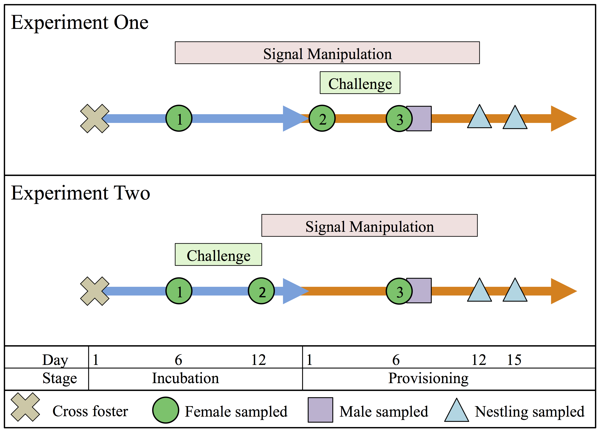

```{r setup, include=FALSE, echo = FALSE}
knitr::opts_chunk$set(echo = TRUE)
#library(stargazer)
```

## **Supplemental Methods**

### *Determining Nest of Origin for Cross-Fostered Nestlings*

Blood samples collected in the field were stored in Queen's lysis buffer [@seutin]. DNA was extracted from nestling and putative mother blood samples using Qiagen DNeasy Blood and Tissue kit spin columns following the manufacturer's protocol. For each sample, we amplified a set of 9 microsatellite markers that were previously developed for and validated in this population of tree swallows [@makarewich]. These nine loci were amplified in two multiplexed reactions that included 5 and 4 loci each, as described in Hallinger et al. [-@hallinger]. The full list of primer sequences, reaction volumes, and cycling conditions is given in Table S1.

After reactions were complete, we added 1 $\mu$l of the PCR product to 11.9 $\mu$l of formamide and 0.1 $\mu$l of LIZ size standard (GeneScan$^T$$^M$ 500 LIZ$^T$$^M$) and submitted the samples to the Cornell Biotechnology Resources Center for fragment analysis. We re-ran any samples that failed to amplify and all 9 loci were scored for all nestlings and putative mothers in this study except for those noted below where a sample was not available. Peaks for each loci were called using the Microsatellite Plugin in Geneious version 11.0.4 with manual confirmation for each call. 

Because conspecific brood parasitism is rare in tree swallows [@whittingham], we assumed that putative mothers for each nestling included only the 2-3 females associated with nest boxes that were involved in each cross-fostering group. Therefore, we compared the peak calls for each nestling to the set of 2-3 putative mothers and identified matches. We considered nestlings to match a putative mother if their alleles matched at a minimum of 8 out of 9 loci and did not match the other putative mothers at a minimum of 2 out of 9 loci. 

Across the two years, 374 of 386 nestlings matched one female according to these criteria. In 371 of these cases, nestlings matched their putative mother at all 9 loci and in the three cases with one mismatch the putative mother was homozygous at the loci in question and the discrepancy could be explained by a null allele. For the remaining 12 nestlings, two had lost blood samples and were not sequenced, one had no blood sample from the probable mother because she abandoned before capture, one matched two putative mothers at all nine loci, and 8 did not match any putative mother. Those 8 samples that did not match came from two nests in which all nestlings had unclear maternal origin. Those assignments could be the result of sample processing mistakes (e.g., a mislabeled sample for extraction) or a real biological process (e.g., a new female taking over a clutch of eggs already laid). 

In our analyses, we excluded nestlings with unknown maternal origin from analyses that specifically used cross fostering status as a predictor, but included them in analyses that were focused only on the average morphology of nestlings raised in a social nest or overall fledging success. In this study, nestlings were categorized as being raised in a 'home' nest if their genetic and social mother were the same or a 'crossed' nest if their genetic and social mother were different.
  
### *Plumage Measurement*

We measured the overall brightness of feathers collected from the center of the white breast of each female in this study exactly as described in previous work on this population [@taff2019; @taff19biorxiv]. Briefly, four feathers from the breast were stacked and taped onto black construction paper. Reflectance was then measured with an Ocean Optics FLAME-S-UV-VIS spectrophotometer with PX-2 pulsed Xenon light source and WS-1 white standard in OceanView version 1.5.2 (Ocean Optics, Dunedin, FL). Aquisition settings included a 20 nm boxcar width, 10 scan average, and 60 ms integration time. We used a holster on the fiber optic UV/VIS probe so that light was blocked while reading and the probe was held a constant 5 mm distance from the feathers. For each feather stack, we took four separate spectral readings with the probe removed between each reading. 

We processed raw reflectance spectra using the `pavo` package in R [@pavo]. As in Taff et al. [-@taff19biorxiv], we focused on the overall brightness of the breast plumage given by the 'B2' measurement in `pavo`. This measurement represents the average reflectance across the range of 300-700 nm. Finally, the brightness measurements from the four separate spectra were averaged for each individual to arrive at a single brightness measure for each individual in the population before treatments were applied. In this study, we did not collect additional feathers at later time points after treatments, but Taff et al. [-@taff19biorxiv] includes extensive validation data with feathers measured at varying time points after treatments for control and dulled birds.
  
### *Corticosterone Measurement*

We measured the concentration of corticosterone from plasma that was frozen in the field using commercially available enzyme immunoassay (EIA) kits (DetectX Corticosterone, Arbor Assays: K014-H5). Validation and lab testing data on these kits when applied to our population of tree swallows is available in Taff et al. [@taff2019]. We first extracted corticosterone from plasma by adding 5 $\mu$l of plasma to 45 $\mu$l of assay buffer and then proceeding with three rounds ethyl acetate extraction. The final extract was dried overnight in a fume hood and then reconstitutded with 125 $\mu$l of assay buffer. Reconstituded samples were run in duplicate with a 9 point standard curve in 96 well EIA plates. Average extraction efficiency was determined by spiking some samples with a known amount of concentrated corticosterone and determining the percent recovery. 

Using these starting volumes, the lower detection limit for corticosterone was 0.8 ng/$\mu$l and we substitude this value for any samples that were too low to detect. Overall, the extraction efficiency was 96.2%. When comparing replicates of each sample run on the same plate, the intra-plate CV was 11.5%. The inter-plate CV, based on plasma pools run across multiple plates, was 12.7%. 

### *Cortrosyn Validation Experiments*

To ensure that Cortrosyn® had the desired effect in stimulating a maximal corticosterone response, we conducted two validation studies on a separate set of nestlings and adults that were not part of the main study presented here. Once reconstituted, Cortrosyn is not stable at room temperature. Therefore, rather than delivering exact doses based on individual mass, we reconstituted vials of lyophilized Cortrosyn (Amphastar Pharmaceutical Incorporated, Item #054881) and prepared aliquots pre-measured into syringes based on the average mass in our population (on day 15 nestlings weigh approximately the same amount as full grown adults and the same dose was used for both adults and nestlings). Aliquotted Cortrosyn doses were stored frozen for < 2 weeks and thawed immediately before injection.

In 2018, we carried out a validation experiment on 15 day old nestlings from 9 nests. At each nest, individual nestlings were alternately assigned to a Cortrosyn injection group (n = 23 nestlings) or a control group that received a saline injection (n = 20 nestlings). For all nestlings, a baseline blood sample (< 30 $\mu$l) was collected within 3 minutes of disturbance and then nestlings were immediately injected with either 50 $\mu$l of saline or 50 $\mu$l of 0.1 microgram per $\mu$l freshly thawed Cortrosyn. Following injection, two additional blood samples (< 30 $\mu$l) were collected 15 and 30 minutes after injection. 

In 2020, we carried out a separate validation experiment on adult females captured during incubation that were not part of the main study presented here. For each female, we collected a baseline blood sample (< 70 $\mu$l) within 3 minutes of disturbance. All females received a saline injection 50 $\mu$l immediately after this baseline sample was collected and then had a second blood sample (< 30 $\mu$l) taken 30 minutes later. Immediately after this second sample, females were injected with either an additional saline dose of the same volume (n = 9) or a dose of Cortrosyn (n = 9; 50 $\mu$l at 0.1 microgram per $\mu$l). Thirty minutes after this second injection, a final blood sample (< 30 $\mu$l) was collected. For both adults and nestlings in these validation experiments, blood samples were processed and corticosterone measured exactly as described above.

To compare corticosterone between treatment groups, we fit a single model for each dataset (adults and nestlings). For nestlings, we fit a linear mixed model with corticosterone measurement as the response, an interaction between treatment and sampling time point (fit as a factor) as predictors, and individual identity as a random effect. Because multiple nestlings were sampled from the same nest, this model included a random effect for nest of origin. For adults, we fit a similar model, except that there was no need for a random effect for nest since only one female was sampled at each nest. We used the full models to compare circulating corticosterone in saline versus Cortrosyn injected birds at each of the three timepoints. Significance in these mixed models was assessed with p-values based on the Satterthwaite's Method implemented by the `lmerTest` package in R [@lmertest].

### *Microbiome Lab Procedures*

Samples were collected in the field with flocked sterile swabs (Puritan® HydraFlock®; product number 25-3317-H) that were inserted ~1.5 cm into the cloaca and then gently removed while slowly rotating [as in @vo]. We stored samples in 1 mL of RNAlater at -80 C and then extracted DNA according to the manufacturer's protocol with DNeasy PowerSoil DNA Isolation Kits (Qiagen Incorporated). After extraction, we used the 515F and 806R primers with Illumina adapters to amplify the V4 region of the 16S gene following the standard Earth Microbiome Project protocol modified for 10 $\mu$l reactions [@caporaso1; @caporaso2]. In experiment one, we collected microbiome samples only at the first and third captures, while in the second experiment we collected samples from all three captures.

We ran each PCR reaction in triplicate and succesfful amplification was confirmed by running each pooled reaction on a 1% agarose gel. Pooled samples were submitted to the Cornell Biotechnology Resource Center for quantifiaction, library preparation, and sequencing [all lab procedures as described in @taff19biorxiv]. Each sequencing run also included negative control extractions that went through the full procedure from extraction to sequencing with only a sterile swab and RNAlater. Extracted samples from adults were sequenced in two lanes (one each for the 2018 experiment and the 2019 experiment) on an Illumina MiSeq PE 2 x 250 run.

### *Microbiome Bioinformatic Pipeline*

We processed sequences with the exact same workflow described in Taff et al. [-@taff19biorxiv], which was based on a published workflow for processing microbiome sequences by Callahan et al. [-@call17]. All forward and reverse reads were truncated to 180 bp using the 'filterAndTrim' function in the `dada2` package in R [@call16]. After trimming, we proceeded through dereplication, modeling sequencing errors, determining amplified sequence variants (ASVs), merging reads, and removing chimeras all using the default settings in `dada2` in order to create a final set of ASVs for each sample. 

We used the Silva 132 database to make taxonomic assignments [@quast13; @yilmaz14] and built a generalized time-reversible maximum likelihood tree from the ASVs using the `phangorn` package in R [@schliep10]. Subsequent analyses were carried out using the `phyloseq`  and `vegan` package in R to combine the ASV table with sample data, ASV taxonomy, and the phylogenetic tree [@mcmurdie13; @dixon2003vegan]. After removing singletons and non-bacterial ASVs, we processed reads with the `decontam` package to identify and remove likely contaminants [@davis18].

We used the final ASV file to determine the relative abundance of taxa in each sample. For our main analysis, we calculated alpha diversity metrics for each sample after agglomerating taxa at the genus level (Shannon Index, Faith's Phylogenetic Diversity [PD], and Inverse Simpson's Index) using the `phyloseq` and `picante` packages in R [@kembel10; @mcmurdie13]. When calculating alpha diversity metrics, we rarefied all samples to 1000 reads using the 'prune_samples' function in `phyloseq`. 

We tested for differences in alpha diversity across treatment groups using linear models that included alpha diversity at the second or third capture as the response along with first capture diveristy and an interaction between the two treatment levels as predictors. In addition to comparing alpha diversity metrics, we also tested for dissimilarity in the microbiota community composition between teh treatment groups using the `vegan` package in R [@dixon2003vegan]. For these analyses, we calculated Bray-Curtis dissimilarity matrices using principal coordinate analyses (PCoA). Differences between treatment groups were assessed by PERMANOVA tests as implemented by the `adonis2` function in `vegan`. When significant effects were detected with PERMANOVA, we moved on to dispersion tests with the `betadisper` function to determine whether differences were driven by within-group dispersion.

## **Supplementary Results**

### *Cortrosyn Validation Results*

Injection with Cortrosyn led to a clear increase in circulating corticosterone in both nestlings (Figure S2) and adults (Figure S3). For nestlings, corticosteone increased in both groups from baseline to 15 minutes, but increased significantly more in the Cortrosyn injected group when compared to saline injection. From 15 to 30 minutes, saline injected nestlings declined in circulating corticosterone, but Cotrosyn injected nestlings continued to rise, resulting in an even larger difference in circulating corticosterone between the two groups at 30 minutes (Table S2, P < 0.003). 

Adult females similarly increased circulating corticosterone from baseline to 30 minutes. The two treatment groups did not differ at the first or second timepoint (before Cortrosyn was injected). However, by the final timepoint (30 minutes after injection), the Cortrosyn injected group had significantly higher circulating corticosterone. This difference was driven by a continued increase in corticosterone from 30 to 60 minutes in the Cortrosyn group coupled with a stable circulating level from 30 to 60 minutes in the saline injected group (Table S2, P < 0.001). 


\newpage
## **Supplementary Tables**

### **Table S1.** Details on primers, reaction composition, and cycling conditions for microsatellite analysis. 

\ 

\newpage
### **Table S2.** Results of Cortrosyn validation experiment for nestlings and adults.
\

\newpage 

## **Supplementary Figures**

\ 

### **Figure S1.** Illustration of the timeline for both experiments. 


\newpage
\ 

### **Figure S2.** Validation of cortrosyn injection in nestlings.
Nestlings within a nest were randomly assigned to receive a saline or cortrosyn injection immediately after the baseline blood sample was collected. Two additional blood samples were taken 15 and 30 minutes after the injection.

\newpage
\ 

### **Figure S3.** Validation of cortrosyn injection in adult females.
All adult females received a saline injection immediately after the baseline blood sample was collected. Individuals were then randomly assigned an additional saline or a cortrosyn injection immediately after the 30 minute blood sample. A final blood sample was collected at 30 minutes after the second injection.

\newpage
\

### **Figure S4.** Relative abundance of phyla by treatment experiment one.
Stacked barplots show the relative abundance of different phyla at each capture time for experiment one.

\newpage
\

### **Figure S5.** Relative abundance of phyla by treatment experiment two.
Stacked barplots show the relative abundance of different phyla at each capture time for experiment two.

\newpage
\

### **Figure S6.** Ordination plot for first experiment.
Panels show bray-curtis ordination with PCoA for each capture in the first experiment. Lines show 90% ellipses for each treatment group.

\newpage
\

### **Figure S7.** Ordination plot for second experiment.
Panels show bray-curtis ordination with PCoA for each capture in the second experiment. Lines show 90% ellipses for each treatment group.

\newpage
## **Supplementary References**
 
 
